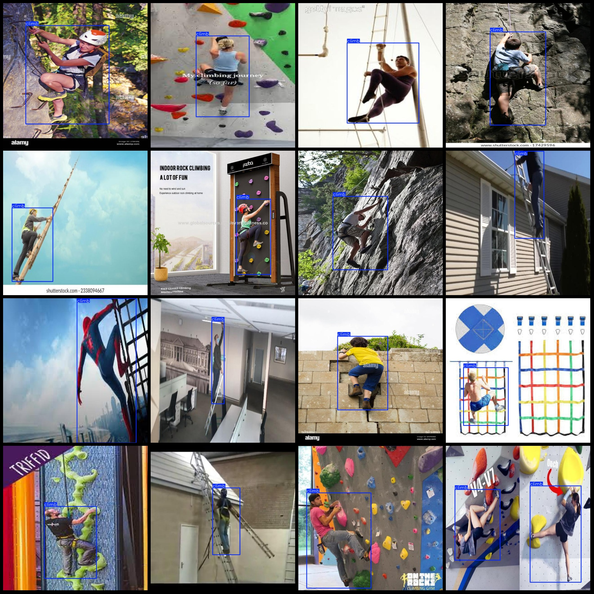
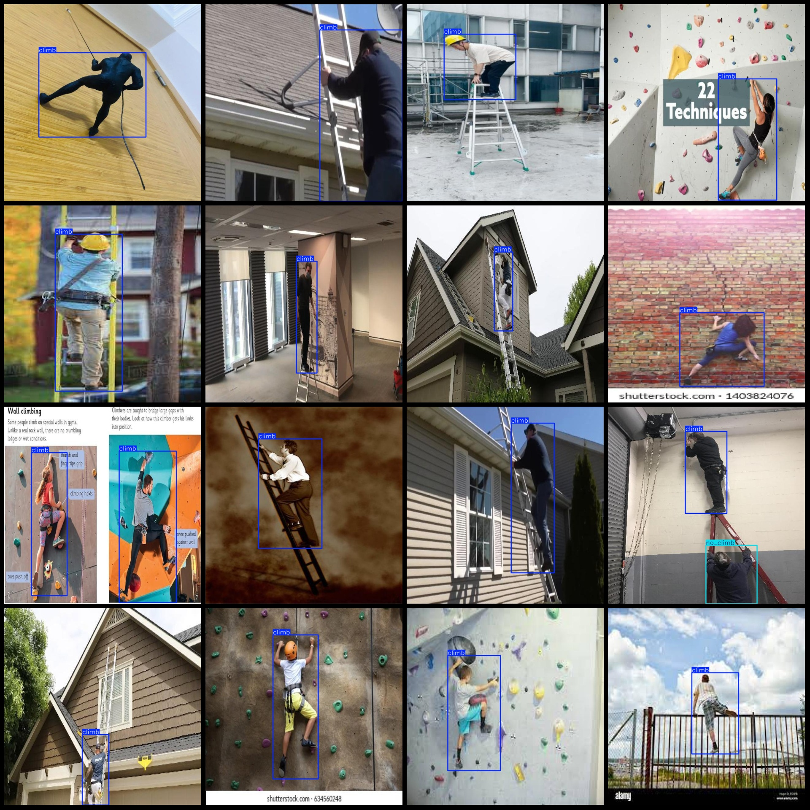

# Climb Detection Dataset VOC+YOLO Format with 6135 Images in 2 Categories

Dataset format: Pascal VOC format + YOLO format (txt file without split path, only containing jpg images along with corresponding VOC format xml files and yolo format txt files)
Number of images (number of jpg files): 6135
Number of annotations (number of xml files): 6135
Number of annotations (number of txt files): 6135
Number of categories: 2
Annotation category names (note that the order of labels in yolo format does not correspond to this, but is based on the labels folder 'classes.txt'): ["climb", "no_climb"]
Each category's number of bounding boxes:
- Climb: 6503
- No_climb: 581
Total bounding boxes: 7084
Number of images each category occupies:
- Climb: 6017
- No_climb: 448
Image resolution: 640x640
Annotation tool used: labelImg
Annotation rules: draw bounding boxes for categories
Important note: The dataset does not have been divided into training, validation, or test sets and must be manually partitioned.
Special declaration: This dataset does not guarantee any accuracy on trained models or weight files.
Image preview:
Annotation example:

## Images

Here is a pay link on Stripe ( https://buy.stripe.com/3cs8yP7sY87d0vu9AB ). Please contact me lonlonago@foxmail.com after funding $89, and I will send you a complete data files , thank you!

